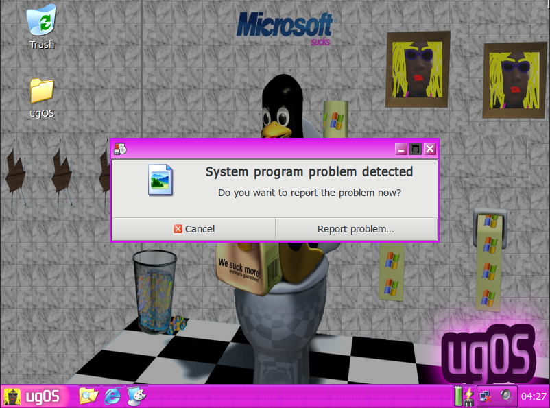

# ugOS
> Sistema Operacional baseado em Ubuntu Minimal

<!-- Imagens estáticas -->
![apache-img]
![build-img]

<!-- Fork e Stars Dinâmico -->
![fork-img]
![stars-img]

Este é um sistema operacional desenvolvido com base em *Ubunutu Minimal 18.04 64bits*, com interface baseada em *Lubuntu Desktop* e personalização estilizada do glorioso *Microsoft Windows XP* - roseMode.

### Principais Modificações
- Tema
- Icones inspirados no Windows XP
- Boot screen
- Janela de logout

_Mais imagens em [assets/img](./assets/img)._

### NOTA

**A VERSÃO ATUAL TEM PROBLEMAS DE SEGURANÇA !!!**

Durante o desenvolvimento modificamos permissões de diversas pastas (chmod 777).
Não recomendamos que use essa versão como seu sistema principal, espere a proxima versão!

## Instalação
### Requisitos minímos
- [Oracle VM VirtualBox][vbox];
- Memoria RAM 1,00 GB;
- HardDisk 10,00 GB;
- Só.

### Execução
<!-- Contagem começa do 0 porque nóis é programador -->
0. Faça o [donwload da ISO do ugOS][ugOS]

1. Após o download, abra o [Oracle VM VirtualBox][vbox] e acrescente uma nova máquina baseada nos requisitos mencionados na sessão requisitos minímos;

2. No momento da inicialização da nova máquina aponte para ISO do ugOS, que você acabou de baixar.

3. Inicie o sistema operacional utilizado as [váriaveis de ambiente](./env/.env)

4. USE

## Exemplo se uso
Nele você encontrará diversos apps nativos (não licenciados, porém funcionais), como *Wine, MsPaint, Office 97,* entre outros.

Divirta-se como excelentes jogos como *CS 1.6, Pinball,  Extreme tux racer*

## Configuração para Desenvolvimento
Entre em contato com o [Desenvolvedor] para informações de como pode contribuir.

## Histórico de lançamento
 * 0.1
    * Initial commit

## Meta

- `README.md`

Douglas Damasio - [@douglasdamasio] - douglasdamasio18@gmail.com

- `LICENSE`

Distribuído sob a licença Apache 2. Veja `LICENSE` para mais informações.

## Contribuição

1. Faça o _fork_ do projeto (<https://github.com/Gui1949/ugOS/fork>)
2. Crie uma _branch_ para sua modificação (`git checkout -b feature/nova-contrib`)
3. Faça o _commit_ (`git commit -am 'add nova-contrib'`)
4. _Push_ (`git push origin feature/nova-contrib`)
5. Crie um novo _Pull Request_

<!-- links -->
[apache-img]:https://img.shields.io/badge/license-Apache%202-blue
[build-img]:https://img.shields.io/badge/build-passing-brightgreen
[fork-img]:https://img.shields.io/github/forks/gui1949/ugOs?style=social
[stars-img]:https://img.shields.io/github/stars/gui1949/ugOS?style=social
[vbox]:https://www.virtualbox.org/
[ugOS]:https://drive.google.com/open?id=13W6wEaw72PVssDYFQaVpfnSd9295es1b
[desenvolvedor]:https://github.com/Gui1949
[@douglasdamasio]:https://github.com/douglasdamasio